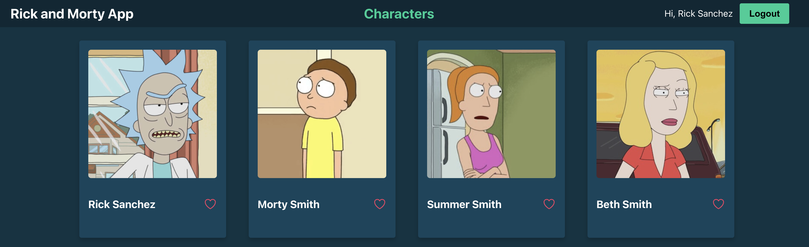

# Rick and Morty App


# Table of content
- [Project Structure](#project-structure)
- [Goal](#goal)
- [Features](#features)
  - [Api](#api)
  - [Web](#web)
- [Running this project](#running-this-project)
- [Improvements](#improvements)

## Project Structure
This project has been bootstrapped using a template from [Turborepo](https://turbo.build/)

I've decided to use a **mono repository architecture** to benefit from sharing types and configs across the 2 main applications.

```
.
├── apps
│   ├── api
│   └── web
└── packages
    ├── config-eslint
    ├── config-typescript
    ├── domain
    └── jest-presets
```
Apps
- `api`: [Express](https://expressjs.com/) server
- `web`: React spa bundled with [Vite](https://vitejs.dev/)

Packages
- `config-eslint`: Base ESLint configurations 
- `config-typescript`: tsconfig.json's used throughout the monorepo
- `domain`: Shared Typescript types
- `jest-presets`: Base jest configuration to work with Typescript


## Goal
The goal of this project is to have a fancy application, with backend and frontend, that consumes the public API of
Rick & Morty: https://rickandmortyapi.com and allows users to select which characters are their **favourite**.

## Features

## API

The **api** is a **express** server in conjunction with a PostgreSQL database. The connection to the database is handled via
[typeorm](https://typeorm.io/) and Entities are managed using the Repository pattern.

There are 2 types of entities persisted to the database:

- User
- FavCharacter

The first one needs no explanation, the second one stores the relation between Users and their favorite characters from the RickAndMortyAPI.

Authentication of Users is done via JsonWebToken, to acquire one the users have to register first using the endpoint at `/auth/register` and once they have created
their user they can also sign in again making use of the endpoint at `/auth/login`.

### Characters

Users can search for characters from the RickAndMortyAPI using the endpoint at `GET /characters`.

To communicate with the external API I make use of the [official npm package](https://github.com/afuh/rick-and-morty-api-node) published by the API developers. 
The response of every search is intercepted, and each character's data is augmented with the property `favourite: boolean` based on the user's previous marked characters.

A more granular search can be done passing the following Query Parameters to the endpoint at `GET /characters`.

- name
- gender (male, female, unknown)
- status (alive, dead, unkown)
- species
- type

Using the endpoint at `GET /character/:id` users can search for an specific character.

To mark/unmark a character as favourite users can send the payload `{fav: true/false}` to the endpoint at `PATCH /character/:id`.

### Dependencies

- express
- body-parser
- cors
- morgan
- typeorm
- reflect-metadata <-- typeorm needs it
- rickmortyapi
- pg
- jsonwebtoken
- bcrypt
- zod <-- validation of input data

### Dev Dependencies

- supertest
- better-sqlite3 <-- in memory database for tests


## WEB

React SPA (bundled via Vite) that renders a UI to consume the API exposed before.

There are 2 public pages to allow users to signup (/register) and signin (/login). Once the user authenticates a session is stored in the browser's **Local Storage**.

With an active session users can explore the characters, mark them as favourite and see the details of each of them.

### Dependencies

- react
- react-dom
- react-router-dom
- axios
- react-hook-form <-- For form logic and validation.
- clsx <-- to manage dynamic css classes in components.

# Running this project

#### Requirements

- Node >18
- Docker

First, install dependencies:

```
npm install
```

In order to start the project in a local environment first setup the database. 
A docker-compose.yaml file is provided that initiates a PostgreSQL container, to start it just run:

```
docker compose up -d
```

Add a .env file to the `root` directory with the following variables:

```
DATASOURCE_HOST=localhost
DATASOURCE_PORT=5440
DATASOURCE_USER=root
DATASOURCE_PASSWORD=root
DATASOURCE_NAME=rickandmortyapp
JWT_SECRET=<a passphrase to encrypt the tokens>
```

Run the migrations to the database:

```
npm run migration:run
```

To start both apps at the same time in development servers run:

```
npm run dev
```

**WEB** will be exposed at http://localhost:3001 and **API** at http://localhost:5001

To run Unit tests:

```
npm test
```

# Improvements

### Better Authentication

JsonWebTokens issued by the api have no expiration in order to spend less time tweaking the user's session management in the web app.

A better solution would be using a Identity as a Service (IDaaS) platform like [Auth0](https://auth0.com/) or [Clerk](https://clerk.com/)

### End-user experience

Although the api allows to perform more granular search of characters via filtering different properties like `gender` or `status`, the UI currently only allows to search by character name.

### Tests

Only a set of unit and integration tests for the `api` package have been implemented. This projects lacks frontend tests for components and UI logic.
Moreover, the whole application could benefit of some **end-to-end** tests using frameworks like [Cypress](https://www.cypress.io) or [Playwright](https://playwright.dev).


